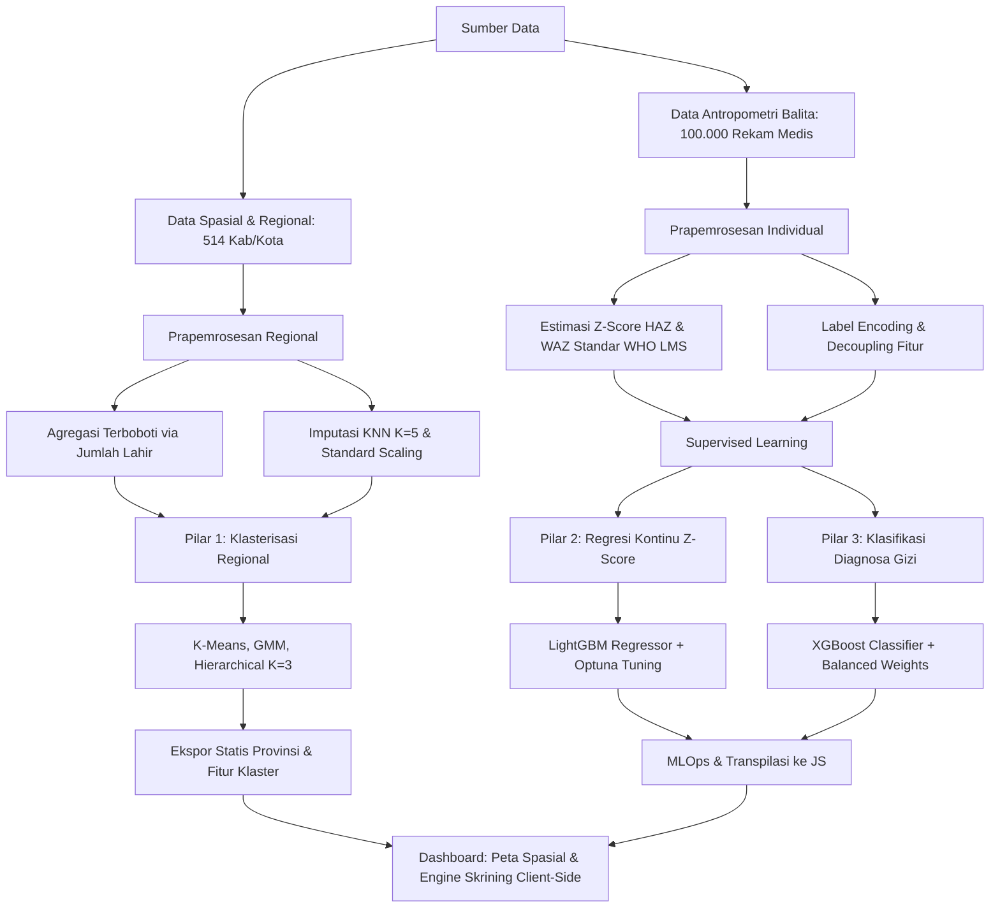

# BAB III: METODOLOGI PENELITIAN

Metode penelitian ini memaparkan alur kerja terintegrasi yang menggabungkan analisis spasial-regional, estimasi pertumbuhan antropometri berbasis standar World Health Organization (WHO), dan diagnosa status gizi balita menggunakan pendekatan *Machine Learning* (ML) tiga pilar: klasterisasi regional (unsupervised), regresi Z-score kontinu (supervised), dan klasifikasi diagnosa gizi multikelas (supervised). 

Seluruh model yang dikembangkan diintegrasikan ke dalam sebuah dashboard interaktif berbasis web. Dashboard ini menerapkan konsep *client-side inference*, di mana model machine learning dievaluasi secara langsung pada browser pengguna tanpa bergantung pada komputasi server API backend.

---

## 3.1. Desain Penelitian dan Alur Kerja Umum

Alur kerja penelitian dibagi menjadi tiga tahapan utama: akuisisi data, proses pemodelan ML (tiga pilar), dan implementasi MLOps sisi klien. Hubungan logis antar tahapan tersebut dipetakan dalam diagram alir berikut:



---

## 3.2. Sumber Data dan Karakteristik Dataset

Penelitian ini memanfaatkan dua rumpun dataset utama untuk memecahkan permasalahan analisis makro (tingkat daerah) dan mikro (tingkat balita):

### 3.2.1. Dataset Indikator Gizi Regional (Tingkat Kabupaten/Kota)
Dataset ini diperoleh dari data historis status gizi tingkat Kabupaten/Kota se-Indonesia tahun 2018-2020 (`Data-Status-Gizi-2018-2020-Kabupaten-Kota.xlsx`). Dataset berisi data spasial yang mencakup 514 wilayah administratif kabupaten dan kota di Indonesia.

**Tabel 3.1. Skema Fitur Dataset Regional**
| Nama Fitur | Tipe Data | Deskripsi / Representasi Indikator |
| :--- | :--- | :--- |
| `Jumlah_Lahir` | Numerik (Integer) | Jumlah kelahiran hidup tahunan di wilayah terkait. Digunakan sebagai bobot agregasi. |
| `Stunting_2019` | Numerik (Persentase) | Prevalensi stunting tingkat kabupaten/kota tahun 2019 (target klasterisasi). |
| `KEK_Ibu_Hamil` | Numerik (Persentase) | Prevalensi Ibu Hamil dengan Kurang Energi Kronis (KEK). |
| `BBLR` | Numerik (Persentase) | Prevalensi Bayi Berat Lahir Rendah (BBLR) (< 2500 gram). |
| `Imunisasi_Dasar` | Numerik (Persentase) | Cakupan imunisasi dasar lengkap pada anak usia di bawah dua tahun. |

### 3.2.2. Dataset Antropometri Balita Individual
Dataset ini terdiri dari 100.000 rekam medis antropometri balita (`stunting_wasting_dataset.csv`) yang dibuat dengan mensimulasikan sebaran fisik anak berdasarkan parameter riil populasi Indonesia dan WHO Child Growth Standards.

**Tabel 3.2. Skema Fitur Dataset Antropometri Balita**
| Nama Fitur | Tipe Data | Deskripsi Fitur / Parameter Fisik | Rentang / Nilai |
| :--- | :--- | :--- | :--- |
| `Jenis Kelamin` | Kategorikal | Biner penentu acuan standardisasi pertumbuhan. | Laki-laki (0), Perempuan (1) |
| `Umur (bulan)` | Numerik (Integer) | Usia anak dalam satuan bulan sejak lahir. | $0 - 60$ bulan |
| `Tinggi Badan (cm)`| Numerik (Float) | Tinggi badan (atau panjang badan untuk anak < 2 tahun). | $40.0 - 120.0$ cm |
| `Berat Badan (kg)` | Numerik (Float) | Berat badan anak saat pemeriksaan fisik. | $2.0 - 30.0$ kg |
| `Stunting` | Kategorikal | Status diagnosis stunting (target klasifikasi). | *Normal*, *Severely Stunted*, *Stunted*, *Tall* |

---

## 3.3. Prapemrosesan Data

Tahapan prapemrosesan dilakukan secara ketat untuk mempersiapkan data mentah sebelum dimasukkan ke dalam model ML serta mencegah kebocoran informasi (*data leakage*):

### 3.3.1. Prapemrosesan Data Regional (Analisis Spasial)
1. **Agregasi Terboboti (Weighted Aggregation)**: Untuk meminimalkan bias populasi saat melakukan agregasi data kabupaten/kota ke tingkat provinsi, prevalensi rata-rata provinsi dihitung menggunakan bobot jumlah kelahiran hidup tahunan ($W_i = \text{Jumlah\_Lahir}_i$):
   $$\bar{X}_{\text{prov}} = \frac{\sum_{i=1}^{n} X_i \cdot W_i}{\sum_{i=1}^{n} W_i}$$
   di mana $X_i$ adalah prevalensi indikator gizi pada kabupaten/kota $i$ di bawah provinsi terkait, dan $n$ adalah jumlah kabupaten/kota di provinsi tersebut.
2. **Imputasi KNN (K-Nearest Neighbors)**: Nilai kosong (*missing values*) pada fitur diisi menggunakan KNN Imputer ($K=5$). Nilai kosong digantikan berdasarkan rata-rata tertimbang dari 5 wilayah tetangga terdekat dalam ruang fitur terstandarisasi. Jarak antarwilayah dihitung menggunakan metrik Euclidean:
   $$d(x, y) = \sqrt{\sum_{j=1}^{d} (x_j - y_j)^2}$$
3. **Pembersihan Multikolinearitas**: Fitur stunting tahun 2018 dieliminasi karena memiliki koefisien korelasi Pearson $r > 0.90$ dengan fitur stunting tahun 2019. Hal ini dilakukan untuk menghindari bobot ganda pada fitur yang redundan dalam proses klasterisasi berbasis metrik jarak.
4. **Standardisasi Fitur**: Fitur numerik ditransformasikan ke skala seragam menggunakan *Z-score Standardizer* (mean = 0, std dev = 1) untuk menyeimbangkan pengaruh skala unit yang berbeda:
   $$z = \frac{x - \mu}{\sigma}$$

### 3.3.2. Prapemrosesan Data Individual (Pilar Klasifikasi & Regresi)
1. **Kalkulasi Skor Z-Score WHO**: Untuk memperoleh ukuran kuantitatif status pertumbuhan anak berupa HAZ (*Height-for-Age Z-score*) dan WAZ (*Weight-for-Age Z-score*), digunakan rumus transformasi Box-Cox LMS dari WHO Child Growth Standards:
   $$\text{Z-score} = \frac{\left(\frac{Y}{M}\right)^L - 1}{L \times S}$$
   di mana:
   - $Y$ adalah nilai pengukuran antropometri fisik anak (Tinggi Badan untuk HAZ, Berat Badan untuk WAZ).
   - $L$ adalah parameter *skewness* (kemiringan distribusi) untuk umur dan jenis kelamin terkait.
   - $M$ adalah parameter *median* (nilai tengah populasi acuan).
   - $S$ adalah parameter *coefficient of variation* (koefisien variasi populasi acuan).
   
   Jika $L = 0$ (distribusi log-normal sempurna), maka Z-score dihitung menggunakan rumus alternatif:
   $$\text{Z-score} = \frac{\ln(Y/M)}{S}$$

2. **Dekopling Fitur (Feature Decoupling)**: Guna mencegah kebocoran informasi (*data leakage*) pada model regresi Z-score:
   - Model regresi HAZ hanya dilatih menggunakan fitur masukan: `[Jenis Kelamin, Umur, Tinggi Badan]`.
   - Model regresi WAZ hanya dilatih menggunakan fitur masukan: `[Jenis Kelamin, Umur, Berat Badan]`.
   - Variabel diagnosa klasifikasi stunting dipisahkan sepenuhnya dari input regresi agar model tidak menebak Z-score secara langsung dari label klasifikasi.
3. **Label Encoding**: Fitur kategorikal `Jenis Kelamin` disandikan secara biner (Laki-laki $\rightarrow$ 0, Perempuan $\rightarrow$ 1). Target kelas diagnosa stunting (`Stunting`) disandikan secara integer sebagai berikut:
   - *Normal* $\rightarrow$ 0
   - *Severely Stunted* $\rightarrow$ 1
   - *Stunted* $\rightarrow$ 2
   - *Tall* $\rightarrow$ 3

**Pseudo-code 3.1. Algoritma Kalkulasi Z-score WHO LMS pada Python**
```python
Algoritma Kalkulasi_Z_Score_WHO(Jenis_Kelamin, Umur_Bulan, Nilai_Ukuran, Tipe_ZScore):
    Input: 
        Jenis_Kelamin (0: Laki-laki, 1: Perempuan)
        Umur_Bulan (Integer, rentang 0-60)
        Nilai_Ukuran (Float, nilai tinggi dalam cm atau berat dalam kg)
        Tipe_ZScore ("HAZ" atau "WAZ")
    Output:
        Z_Score (Float, nilai Z-score kontinu)

    1.  Tentukan tabel referensi WHO (LMS) berdasarkan Jenis_Kelamin dan Tipe_ZScore.
    2.  Cari baris data pada tabel referensi di mana baris.Umur = Umur_Bulan.
    3.  Ekstrak nilai parameter L, M, dan S dari baris tersebut.
    4.  Jika L != 0:
            Z_Score = (((Nilai_Ukuran / M) ** L) - 1) / (L * S)
        Jika L == 0:
            Z_Score = ln(Nilai_Ukuran / M) / S
    5.  Kembalikan Z_Score
```

---

## 3.4. Arsitektur Pemodelan Machine Learning

Penelitian ini menggunakan tiga arsitektur pemodelan terpisah berdasarkan tugas komputasi masing-masing pilar:

### 3.4.1. Pilar 1: Klasterisasi Regional (Unsupervised Learning)
Tujuan pilar pertama adalah mengelompokkan wilayah ke dalam 3 kelompok kerentanan stunting tingkat provinsi ($K=3$). Tiga model klasterisasi dievaluasi:
1. **K-Means Clustering**: Mengelompokkan wilayah dengan meminimalkan jumlah kuadrat jarak Euclidean antara titik data dan centroid klaster terkait ($S_k$):
   $$J = \sum_{k=1}^{K} \sum_{i \in S_k} \| x_i - \mu_k \|^2$$
   di mana $\mu_k$ adalah centroid dari klaster $k$.
2. **Gaussian Mixture Model (GMM)**: Mengasumsikan data regional didistribusikan berdasarkan kombinasi linier dari 3 distribusi komponen Gaussian dengan bobot komponen $\pi_k$, rata-rata $\mu_k$, dan matriks kovarians $\Sigma_k$:
   $$p(x) = \sum_{k=1}^{K} \pi_k \mathcal{N}(x \mid \mu_k, \Sigma_k)$$
3. **Hierarchical Agglomerative Clustering**: Membangun klaster secara bertahap (*bottom-up*) menggunakan kriteria Ward's Linkage yang bertujuan meminimalkan peningkatan variansi total di dalam klaster pada setiap langkah penggabungan:
   $$\Delta(A, B) = \frac{n_A n_B}{n_A + n_B} \| \mu_A - \mu_B \|^2$$

### 3.4.2. Pilar 2: Regresi Kontinu Z-Score (Supervised Learning)
Tujuan pilar kedua adalah mengestimasi kurva pertumbuhan fisik anak secara kontinu (HAZ dan WAZ). Evaluasi dilakukan terhadap model *Linear Regression*, *Ridge Regression*, *Random Forest Regressor*, *XGBoost Regressor*, *LightGBM Regressor*, dan *CatBoost Regressor*. 

**LightGBM Regressor** terpilih sebagai arsitektur final. Berbeda dengan regresi konvensional, LightGBM menggunakan metode pertumbuhan daun (*leaf-wise growth*) berbasis *Gradient-based One-Side Sampling* (GOSS) dan *Exclusive Feature Bundling* (EFB). Model ini memotong pohon pada daun dengan perolehan delta loss terbesar (bukan berbasis level-wise), sehingga mampu memodelkan kelengkungan pertumbuhan fisik anak yang kompleks dengan tingkat kesalahan minimal.

### 3.4.3. Pilar 3: Klasifikasi Diagnosa Gizi Multikelas (Supervised Learning)
Tujuan pilar ketiga adalah mendiagnosa status gizi balita ke dalam 4 kategori diskrit. Evaluasi dilakukan terhadap model *Random Forest*, *Extra Trees*, *XGBoost*, *LightGBM*, dan *CatBoost*.

**XGBoost Classifier** terpilih sebagai model klasifikasi terbaik. XGBoost meminimalkan fungsi tujuan regularisasi berikut pada iterasi ke-$t$:
$$\mathcal{L}^{(t)} = \sum_{i=1}^{N} l\left(y_i, \hat{y}_i^{(t-1)} + f_t(x_i)\right) + \Omega(f_t)$$
di mana penalti kompleksitas model ($\Omega$) didefinisikan sebagai:
$$\Omega(f_t) = \gamma T + \frac{1}{2}\lambda \sum_{j=1}^{T} w_j^2$$
di mana $T$ adalah jumlah daun dan $w_j$ adalah bobot skor pada daun $j$. Arsitektur pohon ter-regularisasi ini menghasilkan model klasifikasi yang sangat andal dan memiliki ukuran representasi yang ringkas untuk transpilasi sisi klien.

---

## 3.5. Desain Eksperimen dan Validasi

Skenario eksperimen dirancang untuk menjamin kestabilan model di bawah kondisi data yang tidak seimbang serta mengoptimalkan struktur pohon keputusan.

### 3.5.1. Skema Validasi Silang (Cross-Validation)
- **Model Klasifikasi (XGBoost)**: Dievaluasi menggunakan **Stratified 5-Fold Cross Validation**. Skema ini membagi dataset menjadi 5 bagian dengan mempertahankan proporsi kelas target (Normal, Severely Stunted, Stunted, Tall) secara konsisten pada setiap fold untuk menghindari bias pemisahan data.
- **Model Regresi (LightGBM)**: Dievaluasi menggunakan **Standard 5-Fold Cross Validation** dengan target prediksi kontinu Z-score HAZ dan WAZ.

### 3.5.2. Penanganan Ketidakseimbangan Kelas (Class Imbalance)
Karena prevalensi kategori stunting ekstrem (*Severely Stunted* dan *Tall*) relatif sedikit dibandingkan kategori *Normal*, dilakukan injeksi bobot sampel balita secara dinamis pada fungsi loss XGBoost selama training menggunakan metode **Balanced Sample Weighting**:
$$w_c = \frac{N}{C \times N_c}$$
di mana:
- $w_c$ adalah bobot untuk kelas $c$.
- $N$ adalah jumlah total sampel rekam medis (100.000).
- $C$ adalah jumlah kelas diagnosis (4).
- $N_c$ adalah jumlah sampel balita yang termasuk dalam kelas $c$.

### 3.5.3. Optimasi Hiperparameter Bayesian (Optuna)
Optimasi hiperparameter pada model LightGBM Regressor dilakukan menggunakan optimasi Bayesian berbasis *Tree-structured Parzen Estimator* (TPE) melalui pustaka **Optuna** selama 10 trial dengan objektif meminimalkan MAE validasi.

**Tabel 3.3. Ruang Pencarian Hiperparameter LightGBM**
| Nama Parameter | Rentang Pencarian | Nilai Terbaik Terpilih |
| :--- | :--- | :--- |
| Jumlah Estimator (`n_estimators`) | $[50, 150]$ | **99** |
| Kedalaman Maksimum Pohon (`max_depth`) | $[3, 8]$ | **8** |
| Laju Pembelajaran (`learning_rate`) | $[0.01, 0.15]$ | **0.1216** |
| Jumlah Daun Maksimum (`num_leaves`) | $[15, 63]$ | **43** |

### 3.5.4. Interpretabilitas Model (Explainable AI via SHAP)
Penerimaan klinis terhadap model black-box dijamin dengan menghitung nilai SHAP (*SHapley Additive exPlanations*). Nilai SHAP dihitung berdasarkan kontribusi marginal fitur $i$ di seluruh permutasi subset fitur $S \subseteq F \setminus \{i\}$:
$$\phi_i(x) = \sum_{S \subseteq F \setminus \{i\}} \frac{|S|!(|F| - |S| - 1)!}{|F|!} \left[ f_x(S \cup \{i\}) - f_x(S) \right]$$
Metodologi ini digunakan untuk menganalisis kontribusi aditif dari variabel umur, berat, tinggi, dan jenis kelamin terhadap keputusan diagnosis stunting pada anak secara global maupun lokal.

---

## 3.6. Metrik Evaluasi Akademis

Kinerja model dievaluasi menggunakan metrik standar yang diakui secara akademis:

### 3.6.1. Metrik Klasterisasi Regional
1. **Silhouette Coefficient ($s$)**: Mengukur seberapa dekat titik data regional dengan klasternya dibandingkan klaster tetangga terdekat:
   $$s(i) = \frac{b(i) - a(i)}{\max(a(i), b(i))}$$
   di mana $a(i)$ adalah rata-rata jarak intra-klaster dan $b(i)$ adalah rata-rata jarak terdekat ke klaster lain.
2. **Adjusted Rand Index (ARI)**: Mengukur kesamaan pembagian klaster antar model yang berbeda dengan melakukan koreksi peluang acak:
   $$\text{ARI} = \frac{\text{RI} - E[\text{RI}]}{\max(\text{RI}) - E[\text{RI}]}$$

### 3.6.2. Metrik Regresi Kontinu Z-Score
1. **Mean Absolute Error (MAE)**:
   $$\text{MAE} = \frac{1}{N} \sum_{i=1}^{N} |y_i - \hat{y}_i|$$
2. **Mean Squared Error (MSE)**:
   $$\text{MSE} = \frac{1}{N} \sum_{i=1}^{N} (y_i - \hat{y}_i)^2$$
3. **Koefisien Determinasi ($R^2$)**:
   $$R^2 = 1 - \frac{\sum_{i=1}^{N} (y_i - \hat{y}_i)^2}{\sum_{i=1}^{N} (y_i - \bar{y})^2}$$

### 3.6.3. Metrik Klasifikasi Diagnosa Gizi
Kinerja klasifikasi XGBoost dievaluasi menggunakan F1-score terboboti (*Weighted F1-score*):
$$\text{Precision} = \frac{\text{TP}}{\text{TP} + \text{FP}}, \quad \text{Recall} = \frac{\text{TP}}{\text{TP} + \text{FN}}$$
$$\text{F1-score}_c = 2 \times \frac{\text{Precision}_c \times \text{Recall}_c}{\text{Precision}_c + \text{Recall}_c}$$
$$\text{Weighted F1-score} = \sum_{c=1}^{C} \left( \frac{N_c}{N} \times \text{F1-score}_c \right)$$

---

## 3.7. Transpilasi Model & Integrasi Dashboard (MLOps Client-Side)

Salah satu kontribusi utama penelitian ini adalah penyederhanaan arsitektur MLOps melalui **Client-Side Inference**. Pendekatan ini menghilangkan kebutuhan untuk menjalankan server Python backend (seperti Flask/FastAPI) yang memakan memori besar serta menimbulkan latensi jaringan.

### 3.7.1. Mekanisme Transpilasi ke JavaScript
Seluruh struktur ensemble pohon keputusan dari model terlatih **XGBoost Classifier** dan **LightGBM Regressors** diekspor dari Python ke format struktur data pohon bersarang JSON (*nested tree structures*). Struktur JSON ini memetakan kondisi percabangan biner pada setiap node keputusan:
- `split`: Fitur indeks yang digunakan untuk membagi data (misal: Umur, Tinggi).
- `split_condition`: Nilai batas pemotongan (*threshold*).
- `yes`: ID node tujuan jika nilai fitur < threshold.
- `no`: ID node tujuan jika nilai fitur >= threshold.
- `leaf`: Nilai keluaran prediksi jika node tersebut merupakan daun (terminasi).

Struktur JSON ini disisipkan langsung ke dalam file JavaScript (`results/predictor.js`).

**Pseudo-code 3.2. Algoritma Transpilasi Pohon Keputusan ke Representasi JSON (Python)**
```python
Algoritma Transpilasi_Model_Ke_JSON(Model_Pohon):
    Input: Model_Pohon (Model LightGBM atau XGBoost yang telah terlatih)
    Output: Pohon_JSON (Struktur JSON representasi pohon keputusan)

    1.  Dapatkan dump struktur pohon dari model (menggunakan model.dump_model() atau booster.get_dump()).
    2.  Inisialisasi daftar kosong untuk menampung pohon terkonversi: Pohon_JSON = []
    3.  Untuk setiap pohon t dalam daftar model:
            a. Buat node akar (Root Node).
            b. Lakukan konversi rekursif pada node:
               Fungsi Konversi_Node(node):
                   Jika node adalah node daun (leaf):
                       Kembalikan struktur {"leaf": node.leaf_value}
                   Selain itu:
                       Kembalikan struktur {
                           "split": node.feature_name,
                           "split_condition": node.threshold,
                           "yes": node.yes_child_id,
                           "no": node.no_child_id,
                           "children": [Konversi_Node(node.yes_child), Konversi_Node(node.no_child)]
                       }
            c. Tambahkan hasil konversi node akar pohon t ke Pohon_JSON.
    4.  Simpan Pohon_JSON ke file JavaScript target (predictor.js).
```

### 3.7.2. Evaluasi Node Rekursif di Sisi Klien
Di dalam browser pengguna (`docs/index.html`), evaluasi fitur dilakukan secara dinamis menggunakan traversal pohon rekursif pada struktur JSON.

**Pseudo-code 3.3. Evaluasi Node Rekursif pada JavaScript**
```javascript
Fungsi Evaluasi_Node_Pohon(node, fitur):
    Input:
        node (Objek Node JSON)
        fitur (Daftar nilai fitur input anak: [Gender, Umur, Tinggi/Berat])
    Output:
        Nilai prediksi daun (Float)

    1. Jika node memiliki properti 'leaf' (tidak kosong):
           Kembalikan node.leaf
    2. Ambil nilai fitur input yang sesuai dengan parameter pembagian: 
           nilai_input = fitur[node.split]
    3. Jika nilai_input < node.split_condition:
           Cari anak_kiri dari node.children di mana nodeid == node.yes
           Kembalikan Evaluasi_Node_Pohon(anak_kiri, fitur)
       Selain itu:
           Cari anak_kanan dari node.children di mana nodeid == node.no
           Kembalikan Evaluasi_Node_Pohon(anak_kanan, fitur)
```

Untuk model XGBoost Classifier, prediksi akhir diperoleh dengan menjumlahkan nilai keluaran dari seluruh pohon keputusan bersarang, diikuti dengan fungsi transformasi *softmax* pada browser klien untuk menghasilkan probabilitas probabilitas multikelas:
$$P(\text{Kelas } c) = \frac{e^{\sum_{t=1}^{T} f_{t, c}(x)}}{\sum_{k=1}^{C} e^{\sum_{t=1}^{T} f_{t, k}(x)}}$$

---

## 3.8. Rangkuman Hasil Eksperimen dan Pemetaan

Bagian ini merangkum seluruh pemetaan dataset, konfigurasi model, performa numerik, dan status implementasi pada dashboard sebagai acuan penulisan naskah publikasi ilmiah bersama.

### 3.8.1. Pemetaan Desain Eksperimen
**Tabel 3.4. Pemetaan Eksperimen dan Prapemrosesan**
| Pilar Analisis | Nama Dataset | Dimensi & Sampel | Langkah Prapemrosesan Utama | Algoritma yang Diuji |
| :--- | :--- | :--- | :--- | :--- |
| **Klaster Spasial (Pilar 1)** | `Data-Status-Gizi-2018-2020-Kabupaten-Kota.xlsx` | 514 Kabupaten/Kota (Makro) | - Agregasi provinsi terboboti kelahiran<br>- KNN Imputer ($K=5$)<br>- Eliminasi multikolinearitas ($r>0.90$)<br>- Standard Z-Score Scaling | - K-Means ($K=3$)<br>- Gaussian Mixture Model ($K=3$)<br>- Hierarchical Clustering ($K=3$) |
| **Regresi Z-Score (Pilar 2)** | `stunting_wasting_dataset.csv` & WHO LMS Tables | 100.000 Rekam Medis (Mikro) | - Perhitungan Box-Cox LMS WHO Z-Score<br>- Label Encoding jenis kelamin<br>- Pemisahan fitur input (decoupling HAZ & WAZ) | - Linear Regression, Ridge<br>- Random Forest Regressor<br>- XGBoost, LightGBM, CatBoost |
| **Klasifikasi Gizi (Pilar 3)** | `stunting_wasting_dataset.csv` | 100.000 Rekam Medis (Mikro) | - Label Encoding fitur & target kelas<br>- Balanced Sample Weighting pada Loss | - Random Forest, Extra Trees<br>- XGBoost, LightGBM, CatBoost |

### 3.8.2. Kinerja Model & Rationale Integrasi Dashboard
**Tabel 3.5. Kinerja Model dan Justifikasi Integrasi Dashboard**
| Tugas Analisis | Model Terbaik | Nilai Metrik Evaluasi Utama | Integrasi Dashboard & Justifikasi MLOps |
| :--- | :--- | :--- | :--- |
| **Klaster Spasial** | **K-Means / GMM / Hierarchical** | Silhouette Score:<br>- Hierarchical: **0.3199**<br>- K-Means: **0.2181**<br>- GMM: **0.1994**<br>Adjusted Rand Index (ARI) = **0.9057** | **Ketiganya disediakan sebagai tombol interaktif**.<br>Pengguna dapat membandingkan struktur klaster secara visual di peta Leaflet. K-Means dipilih sebagai default karena batas batas centroid-nya memiliki interpretabilitas spasial paling baik. |
| **Regresi Z-Score** | **LightGBM** | MAE Validasi:<br>- HAZ MAE: **0.0042** Z-score<br>- WAZ MAE: **0.0028** Z-score<br>Koefisien Determinasi ($R^2$): **0.9976** | **LightGBM Regressor (Optuna Tuned)**.<br>Optuna digunakan untuk fine-tuning. Struktur pohon LightGBM ditranspilasikan ke file JavaScript untuk memprediksi kurva Z-score HAZ/WAZ balita secara kontinu tanpa server API. |
| **Klasifikasi Diagnosa** | **XGBoost** | Weighted F1-Score:<br>- Random Forest: 0.9998<br>- Extra Trees: 0.9985<br>- **XGBoost**: **0.9877**<br>- LightGBM: 0.9862<br>- CatBoost: 0.9650 | **XGBoost Classifier (Sample Weighted)**.<br>Meskipun Random Forest memiliki F1 sedikit lebih tinggi, XGBoost dipilih karena struktur ensemble-nya jauh lebih ramping (compact). Transpilasi XGBoost menghasilkan kode JS yang sangat kecil dan efisien untuk dijalankan pada browser. |
